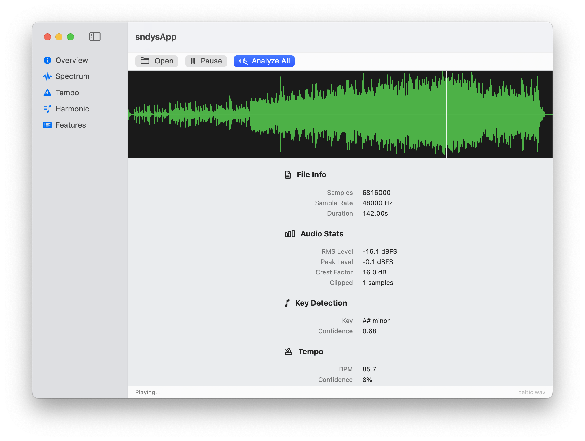
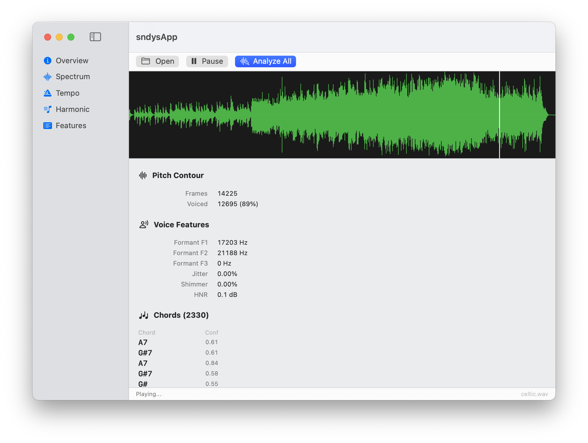
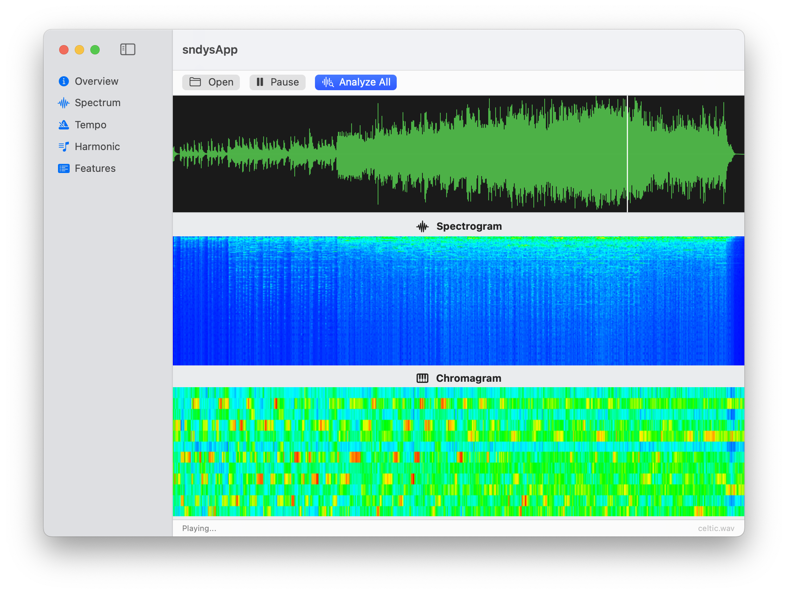
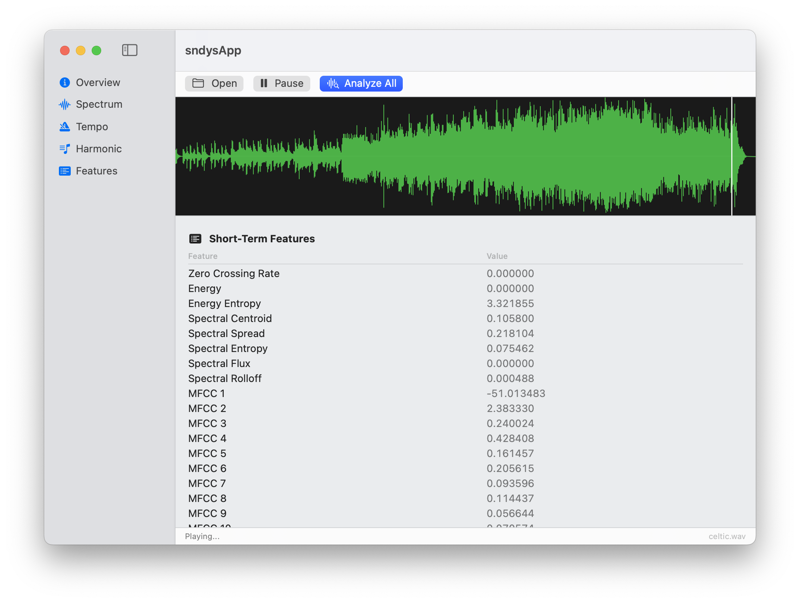

# sndys

An experiment in AI-assisted coding: can Claude write a full audio analysis toolkit in Modula-2 — a language from 1978 — that actually compiles, runs, and produces correct results?

Turns out, yes.

And then: can the same Modula-2 libraries be wrapped in a native macOS SwiftUI app with a C bridge, full async analysis, live waveform playback, spectrogram rendering, and modern HIG compliance?

Also yes.

<p align="center">
  
  
  
  
</p>

## The Experiment

The goal was to port [pyAudioAnalysis](https://github.com/tyiannak/pyAudioAnalysis) — a Python library for audio feature extraction, classification, and segmentation — to PIM4 Modula-2, compiled with the [mx](https://github.com/fitzee/mx) transpiler (Modula-2 → C → native binary).

No Python. No numpy. No scikit-learn. Just Modula-2 procedures, pointer arithmetic, and `LONGREAL`.

The result is **12 pure Modula-2 libraries**, a **44-command CLI tool**, and a **native macOS SwiftUI app** — all sharing the same analysis backend.

## Why Modula-2?

Because it's the hardest way to prove the point. If an AI coding agent can produce sound, modular, correct DSP code in a language with no ecosystem, no Stack Overflow answers, and no training data — and have it match the output of a mature Python library frame-by-frame — then the approach works for anything.

But here's the part that matters: **Modula-2 compiled through mx produces standard C and standard object files.** That means the code doesn't live in a bubble. It links into anything — a CLI tool, a Swift app, a C library, a test harness. The same `.o` files that power the command-line tool are the same `.o` files inside the macOS app. No reimplementation. No "port to Swift." One codebase, multiple front-ends.

This is what separates real engineering from AI slop. Slop generates code that only works in the context it was generated for. This code compiles to a static library, exports clean C symbols, and gets called from Swift through a bridging header — because it was written with real module boundaries, explicit memory ownership, and a compilation model that produces actual linkable artifacts.

Modula-2's `.def` / `.mod` separation turned out to be a surprisingly good fit for audio libraries. Clean interfaces, explicit memory management, no hidden allocations, and — critically — every module compiles to C that any toolchain can consume.

## What's Here

### Libraries

12 independent mx libraries, each with definition modules, implementations, tests, and docs:

| Library | What it does |
|---------|-------------|
| [**m2wav**](m2wav/) | WAV read/write (8/16/24/32-bit PCM), stereo-to-mono, Lanczos downsampling |
| [**m2math**](m2math/) | Extended math — Log, Pow, Floor, Ceil, Hypot, NextPow2 |
| [**m2fft**](m2fft/) | Radix-2 Cooley-Tukey FFT |
| [**m2dct**](m2dct/) | DCT-II/III for MFCC computation |
| [**m2stats**](m2stats/) | Mean, StdDev, Entropy, Normalize, DotProduct |
| [**m2audio**](m2audio/) | 27 modules: feature extraction, beat detection, key detection, chord recognition, note transcription, onset detection, pitch tracking, spectrograms, filtering, classification, segmentation, playback, and more |
| [**m2knn**](m2knn/) | k-NN classifier/regressor, StandardScaler, SMOTE, cross-validation |
| [**m2hmm**](m2hmm/) | Gaussian HMM — Viterbi decoding, supervised training, forward algorithm |
| [**m2kmeans**](m2kmeans/) | K-means clustering with silhouette scoring |
| [**m2pca**](m2pca/) | PCA and LDA via power iteration |
| [**m2tree**](m2tree/) | Decision trees, Random Forest, Extra Trees, Gradient Boosting |
| [**m2svm**](m2svm/) | SVM with linear/RBF kernels (simplified SMO, multi-class OVR) |

### sndys — The CLI

A unified audio analysis toolbox built on all 12 libraries.

**44 commands across 8 categories** — analysis, classification, processing, playback, generation, music intelligence, and more.

**[Full documentation and command reference →](sndys/README.md)**

```
$ sndys analyze samples/celtic.wav
=== samples/celtic.wav ===

Format:     48000 Hz, 2 ch, 24-bit
Duration:   142.00s (6816000 samples)

RMS:        -16.06 dBFS
Peak:       -0.06 dBFS
Crest:      15.99 dB
Key:        A# minor (0.67)
BPM:        85.7 (7% confidence)
Activity:   14 non-silent segments
```

### sndysApp — Native macOS GUI

A SwiftUI desktop application that wraps the Modula-2 analysis libraries through a C bridge. No DSP reimplemented in Swift — every analysis call goes through the same M2 code the CLI uses.

**[Build and run instructions →](sndysApp/README.md)**

Features:
- NavigationSplitView with sidebar (Overview, Spectrum, Tempo, Harmonic, Features)
- Core Graphics waveform with click-to-seek and live playback cursor
- Spectrogram and chromagram heatmaps via CGImage
- Async analysis on background threads with progress indicators
- AVAudioPlayer playback with play/pause toggle
- Native file picker, dark mode, Retina — all automatic via SwiftUI
- SF Symbols throughout

Architecture:
```
SwiftUI Views → SndysBridge.swift → sndys_bridge.c → bridge_all.c (mx --emit-c) → M2 libraries
```

The bridge is 20 exported C functions wrapping the M2 analysis calls. `mx --emit-c` transpiles all 27 M2 modules into a single C file, the bridge appends wrapper functions in the same translation unit (so they can call the `static` M2 functions), and `clang` compiles everything into `libsndys.a`. Swift links against it via a bridging header. That's it.

## The Point About AI-Generated Code

This project was written entirely by Claude — the Modula-2 libraries, the CLI, the defect audit, the C bridge, the SwiftUI app, all of it. But it's not slop. Here's why:

**It compiles to real artifacts.** The M2 code produces `.o` files and `.a` static libraries with exported C symbols. You can link them into any program on any platform that has a C toolchain. That's not a demo — that's an engineering deliverable.

**It was audited and hardened.** A multi-pass defect remediation found and fixed 100+ issues across 46 source files — pointer arithmetic overflow, CARDINAL underflow, division by zero, DEALLOCATE size mismatches, memory leaks, bounds violations. The same classes of bugs that show up in any hand-written systems code. Every fix is minimal, local, and preserves the original design.

**It integrates with native toolchains.** The same libraries that power the CLI also power a SwiftUI app — not through IPC or subprocess calls, but through direct function linking. `mx --emit-c` → `clang` → `libsndys.a` → `swiftc`. No impedance mismatch. No serialization layer. The Swift app calls `sndys_detect_key()` and it runs the same Krumhansl-Schmuckler correlation, the same chromagram computation, the same FFT, that the CLI does.

**It works at the boundary.** The hard part of AI-assisted coding isn't generating a function — it's generating code that plays well with build systems, linkers, foreign function interfaces, memory ownership conventions, and platform-specific toolchains. This project crosses the M2 → C → static library → Swift bridging header → SwiftUI boundary cleanly, because the code was written with those boundaries in mind.

AI slop is code that works in a demo and breaks when you try to use it for anything real. This is code that compiles to a static library and links into a native app. There's a difference.

## Build

### CLI

Requires [mx](https://github.com/fitzee/mx).

```bash
cd sndys
mx build
```

### macOS App

Requires mx, Xcode command line tools, and SDL2 (`brew install sdl2`).

```bash
cd sndysApp
make
open ./build/sndysApp
```

## Validation

The feature extraction pipeline was validated against pyAudioAnalysis v0.3.14 on real audio files. 21 of 34 features match at r=1.0000 correlation with <0.3% error. The remaining 13 (chroma features) show consistent scale offsets due to a numpy advanced-indexing quirk in the reference implementation.

Beat detection was tested against files with known BPM — within 5% of ground truth on all tested tracks.

## Release Notes

See **[RELEASE_NOTES.md](RELEASE_NOTES.md)** for the full defect audit breakdown — 100+ fixes across pointer arithmetic, memory management, bounds safety, division guards, and numerical stability.

## API Documentation

Per-module docs are in [`docs/libs/`](docs/libs/) — covering every procedure in every library.

## Project Structure

```
sndys/
  sndys/                  CLI tool (44 commands)
  sndysApp/               Native macOS SwiftUI app
    Sources/              Swift views + bridge wrappers
    Bridge/               C bridge, build script, libsndys.a
  m2wav/                  WAV I/O
  m2math/                 Extended math
  m2fft/                  FFT
  m2dct/                  DCT
  m2stats/                Statistics
  m2audio/                Audio analysis (27 modules)
  m2knn/                  k-NN + evaluation
  m2hmm/                  Hidden Markov Model
  m2kmeans/               K-means clustering
  m2pca/                  PCA + LDA
  m2tree/                 Decision trees + ensembles
  m2svm/                  Support Vector Machine
  docs/libs/              API documentation
  examples/               Standalone example programs
```
